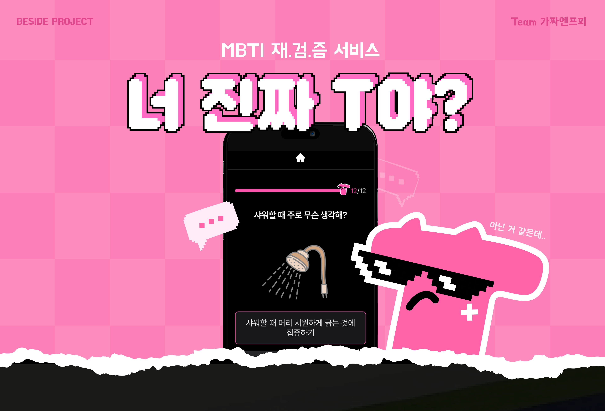

<div align="center">
  <br />
    
  <h1>너 진짜 T야?</h1>
 
  
</div>

<br />

## 프로젝트 소개

<p align="center">
    

  <br />
  <p align="center">
    나도 못 믿고 친구도 못 믿는 내 MBTI, 밸런스게임을 통한 '진짜최종' 검증 서비스
    <br />
    <a href="https://are-you-real-t.vercel.app"><strong>https://are-you-real-t.vercel.app</strong></a>
  </p>
</p>

너 MBTI 안 맞는 것 같은데…

**‘너진짜T야?’** 는 극단 밸런스 게임을 통해 MBTI를 검증하고 토론해 보는 서비스입니다. 다양한 질문을 통해 친구/동료/가족 등 주변 사람들과도 함께 이야기를 나눠보세요🙂

- **검증하기** : 극단 밸런 스게임 선택지를 통해 내 MBTI를 검증하고 결과지를 받아봐요. 카톡으로 결과를 공유할 수도 있어요.

- **토론하기** : 다른 MBTI는 어떤 답변을 했을지 궁금하지 않으신가요? 투표와 댓글 기능을 살펴보세요.

### 프로젝트 관련 링크

> 프로젝트 소개서: https://sneaky-dewberry-efa.notion.site/T-12127d40f64580d2abd8c9e525973800<br/>비사이드 포텐데이 프로젝트 소개: https://bside.best/projects/detail/P240924174648

## 기술 스택


1. `TypeScript`을 사용하여 코드 작성시 타입의 안정성을 높이고, 자동완성 및 타입 추론 기능을 통해 더 나은 개발자 경험(DX)을 중요시했습니다.
2. `React`을 사용함으로써 React에 특화된 프레임워크인 Next.js를 사용할 수 있었습니다.
3. `Next.js`의 App Router 버전을 사용하여 Server Component를 적극적으로 사용하면서 불필요한 JavaScript와 렌더링을 최소화해 성능을 향상시켰습니다.
4. `Data Fetching`은 기본적으로 Next에서 기본으로 제공하는 `fetch` web api를 사용했으며, Client Side에서는 `fetch`를 server action을 통해 사용하려고 노력했으나, 빠른 개발을 위해 `React-Query`도 같이 사용했습니다. 단, 일부 페이지에서만 `React-Query`를 사용하며 동일 데이터를 공유해 사용하지 않기에 사용하는 페이지에서만 Provider로 감싸서 성능을 최적화했습니다.
5. `Vercel`을 사용하여 10일이라는 짧은 프로젝트 기간동안 프로젝트를 빠르고 간편하게 자동으로 배포할 수 있었습니다. Vercel 배포를 무료로 사용하기 위해 해당 Repo를 개인 계정으로 fork 후 Github Action을 이용해 싱크를 맞췄습니다.
6. `TailwindCSS`를 사용함으로써 변수명 고민과 같은 시간을 줄여 빠른 속도로 개발이 가능했습니다.
7. `pnpm`은 npm과 다르게 병렬 설치를 지원하여 성능이 약 2배 빨라 사용했습니다. `yarn`은 Next.js에 포함되는 'swc'가 운영체제에 종속되는 부분이 있어 unplugged 폴더에 저장되고 있어, zero install의 장점을 온전히 누리지 못하기 때문에 선택하지 않았습니다.

## 가짜엔프피 팀

|                              이도원 : FE                              |                                김재영 : BE                                 |
| :-------------------------------------------------------------------: | :------------------------------------------------------------------------: |
|  |  |
|                 [@2dowon](https://github.com/2dwowon)                 |                 [@kjyong702](https://github.com/kjyong702)                 |
|                                 ESTJ                                  |                                    ESTJ                                    |

## 실행방법

### Installation

```bash
pnpm install
```

### Development mode

```bash
pnpm run dev
```

<p align="center">
  <a href="https://bside.best/potenday">
    
  </a>
</p>

<br/>
